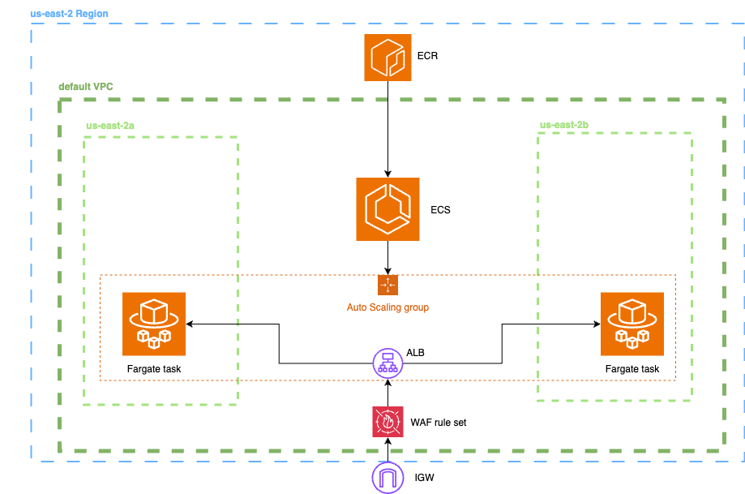
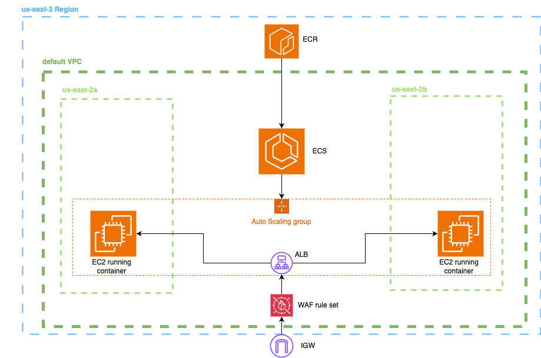
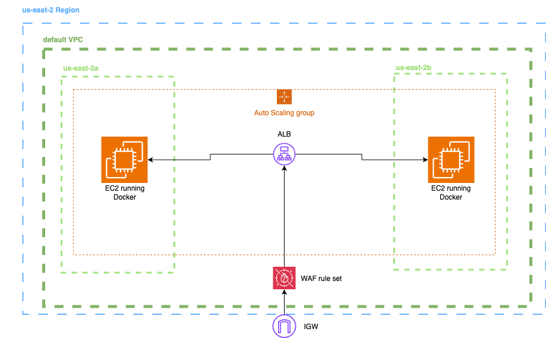
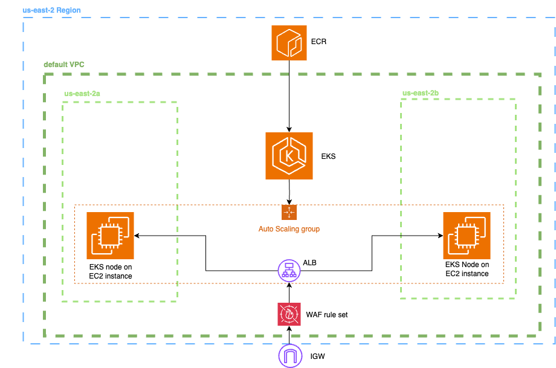

# AWS Container Platform Comparison

AWS-based web application comparing container deployment options (ECS Fargate, ECS on EC2, EC2, EKS) with focus on performance and cost trade-offs.


## Quick Start

### Prerequisites
- [Docker](https://docs.docker.com/get-docker/) and Docker Compose

### Local Demo
View the interactive dashboard locally:

```bash
git clone https://github.com/samhpr/aws-container-webapp.git
cd aws-container-webapp
cp .env.example .env
docker-compose up --build
```

Access at: http://localhost:3000

*Note: Local version uses mock data. For real AWS metrics, deploy using templates in `deploy/` directory and connect to your AWS account.*

> For deploying on your AWS, follow -> [`deploy/README.md`](deploy/README.md).

## Results

*Testing performed using nginx:latest container image, using mainly t3.micro (t3.medium for EKS) instances, on us-east-2 region*

• **Cost**: 94% lower monthly cost with Fargate ($0.61) vs EKS ($10.33) for demo workload  
• **Performance**: CPU utilization ranges from 0.001% (Fargate) to 2.84% (EKS) - 555x efficiency variance  
• **Complexity**: Fargate easiest (30-45 min); EKS most flexible and complex (4+ hours)  
• **Security**: IAM roles, VPC/security groups, ALB + WAF patterns applied across all platforms  
• **Monitoring**: CloudWatch metrics, logs, and real-time performance dashboards integrated  
• **Decision Tool**: Interactive platform selector based on workload characteristics and requirements

*Further testing would include varying traffic to evaluate scalability and cost performance*

  


## AWS Services & Skills

**Services:** ECS (Fargate/EC2), EKS, EC2 Auto Scaling, ALB, WAF, VPC/Security Groups/NACLs, IAM, CloudWatch, Secrets Manager, Systems Manager, Cost Explorer

**Skills:** Container orchestration, cost optimization, performance monitoring, security architecture, Infrastructure as Code patterns, customer decision frameworks

## Architectures

### ECS Fargate Architecture

*Serverless container platform with minimal infrastructure management*

### ECS on EC2 Architecture  

*Managed container orchestration with EC2 instance control*

### Plain EC2 with Docker Architecture

*Traditional virtualized approach with maximum flexibility*

### EKS Architecture

*Kubernetes-native platform for complex orchestration needs*


---

For instructions on deploying to ECS, EKS, or EC2 in your own AWS account, and for the AWS documentation that guided this project, see [deploy/README.md](deploy/README.md)

For further reading (including AWS documentation), challenges, deployment notes, and detailed analysis, see [docs/DETAILED.md](docs/DETAILED.md)