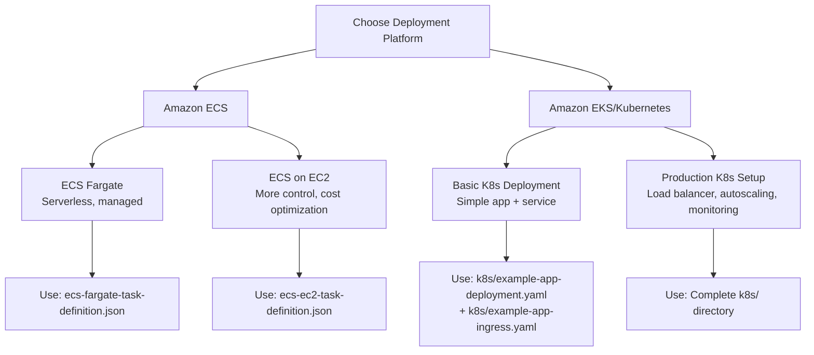

# 🚀 Deployment Decision Guide

## Quick Start - Choose Your Platform



## 📋 Deployment Comparison

| Feature | ECS Fargate | ECS EC2 | Basic K8s | Production K8s |
|---------|-------------|---------|-----------|----------------|
| **Management** | Fully managed | Semi-managed | Manual | Manual |
| **Cost** | Higher per task | Lower (with optimization) | Variable | Variable |
| **Scaling** | Built-in | Built-in | Manual/HPA | Auto (HPA) |
| **Load Balancing** | ALB integration | ALB integration | Basic | AWS ALB Controller |
| **Complexity** | Low | Medium | Medium | High |
| **Best For** | Proof of concept, demos | Production with cost control | Learning K8s | Enterprise production |

## 🎯 Recommended Paths

### For Recruiters/Demo (5 mins)
```bash
# Quick ECS Fargate deployment
cd templates/
# Edit account ID and region in ecs-fargate-task-definition.json
aws ecs register-task-definition --cli-input-json file://ecs-fargate-task-definition.json
```

### For Production Interview Discussion
- **Show ECS knowledge**: Explain Fargate vs EC2 tradeoffs
- **Show K8s expertise**: Walk through the complete k8s/ setup
- **Show DevOps maturity**: Discuss the deployment patterns and security considerations

### For Hands-on Technical Interview
```bash
# Deploy full K8s stack to show comprehensive understanding
kubectl apply -f k8s/
```

## 🔧 What Makes This Deploy Directory Stand Out

1. **Multiple Platform Support** - Shows versatility across AWS services
2. **Production-Ready Configs** - Not just hello-world examples
3. **Security Best Practices** - IRSA, proper resource limits, health checks
4. **Scalability Considerations** - HPA, load balancing, multi-replica
5. **Real-World Complexity** - Load balancer controllers, ingress management
